# 新手学习：ArcGIS 提取SHP 路网数据、节点

## 参考连接

[OSM路网提取道路节点](https://blog.csdn.net/m0_38058163/article/details/91971491#)

[ArcGIS：如何创建地理数据库、创建要素类数据集、导入要素类、表？](https://blog.csdn.net/m0_63001937/article/details/127025901)

[ArcGIS中打断相交线的简便方法](https://blog.csdn.net/chengbaola/article/details/108057887)

## 1. 导入开源路网SHP文件
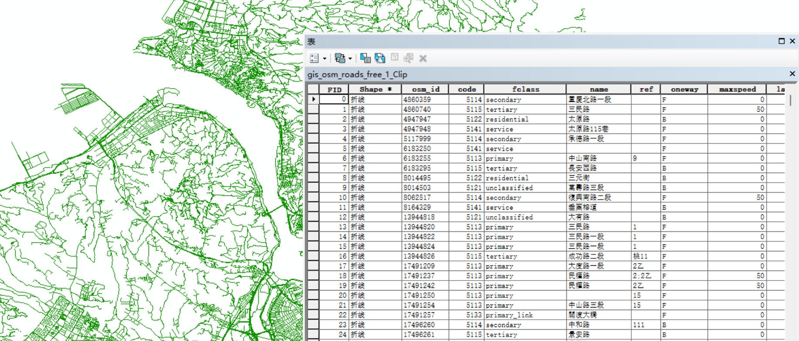

## 2. 在交点处打断路网数据

未打断路网数据
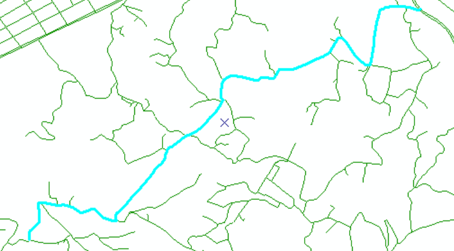
有一些路径很长，并且和多个路径存在交点，所以需要打断相交线。

1. 打开要编辑的shp数据，工具栏中，编辑器-开始编辑，开启编辑状态；

2. 选择图层中的全部要素，在图层上右键-选择-全选；
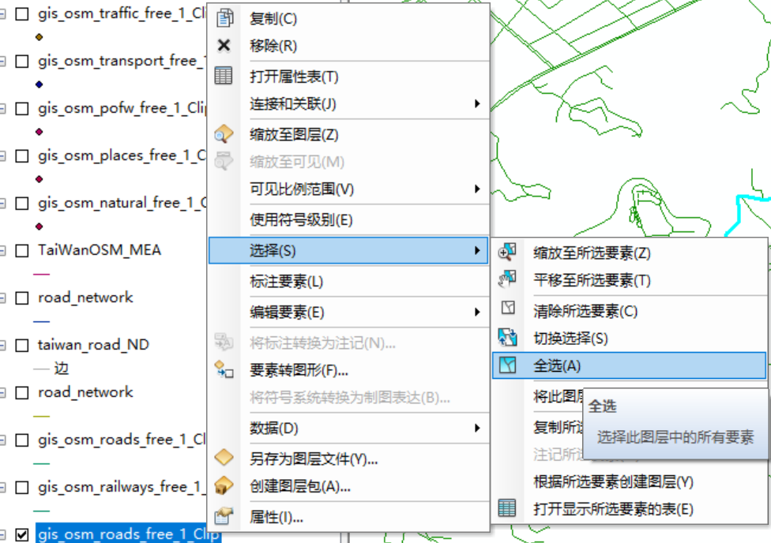

3. 调出拓扑编辑工具条，在菜单栏右键-拓扑；

4. 建立拓扑关系，点击 拓扑 工具栏中的 选择拓扑，选中要建立拓扑关系的图层，并

5. 在线的交点处打断线，点击 拓扑工具栏中的 打断相交线，默认参数，
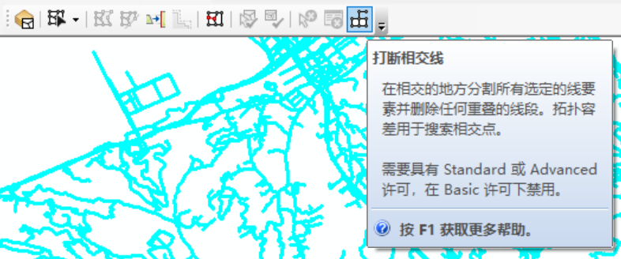

6. 保存编辑

### 如何添加新的命令到工具栏

1. 点击工具栏的自定义
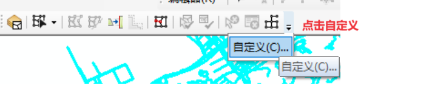

2. 将使用的命令选中拖入工具栏中
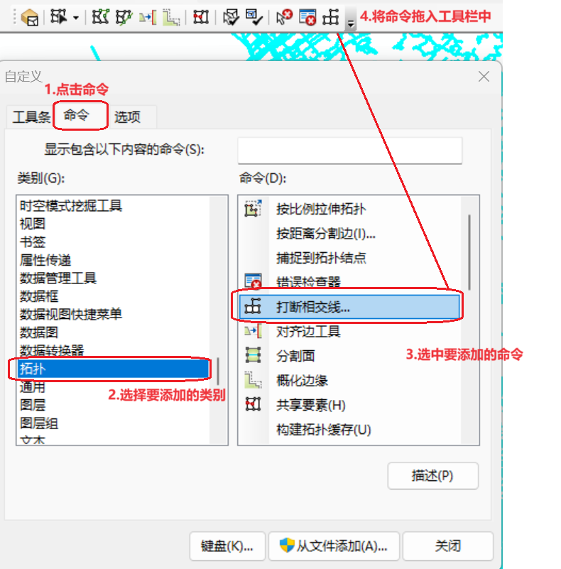

## 3. 建立数据集

1. 打开目录，新建地理数据库
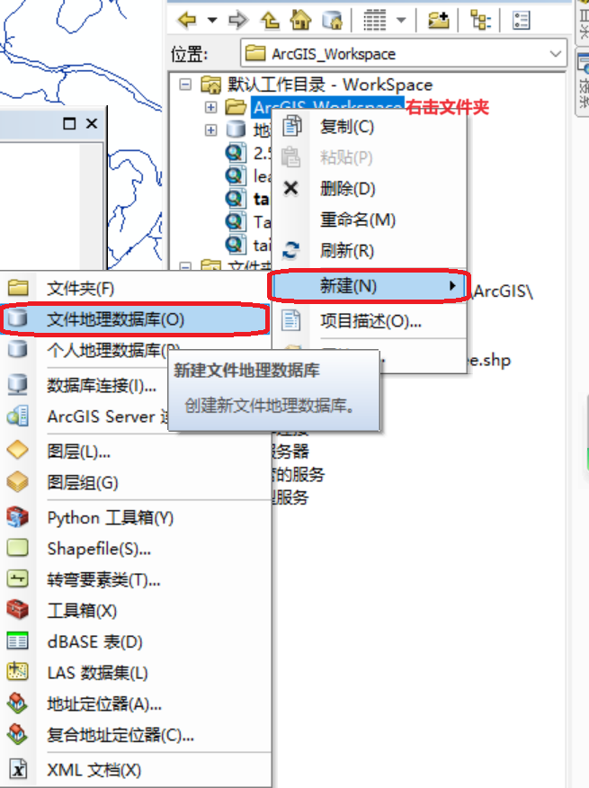

2. 在地理数据库下新建一个要素集
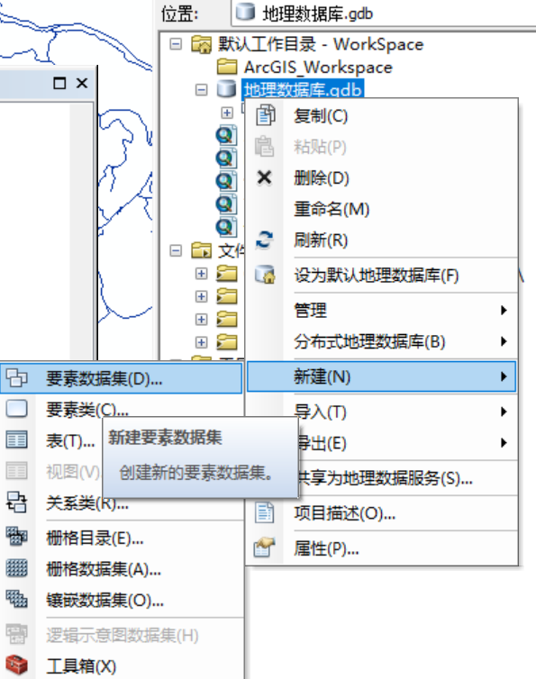

3. 导入要素类
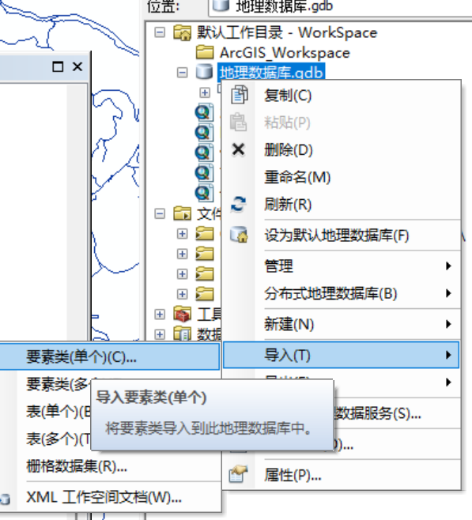

4. 在新建的要素数据集上右键——新建——网络数据集，全部默认就好
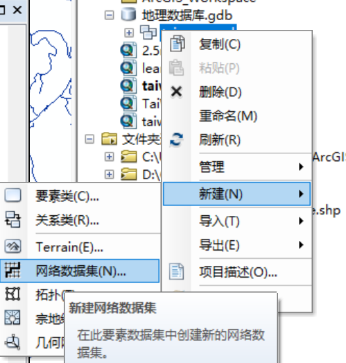

5. 得到网络数据集，包含node 和 edge ，我们只需要其中的 node 和原始的打断的路网 shp，

6. 分别重新导出并重命名一下（便于后续说明）

### 4. 后处理

1、消除 node 中无用的点
使用 Join 操作，可以得到 每个node 和 多少条路相交
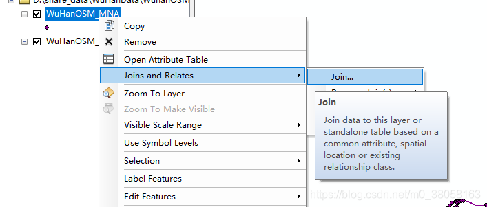

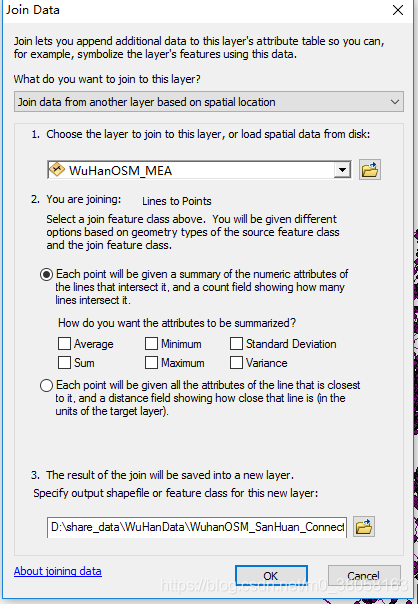

2. 删除一些节点

有一些节点，其连接数为1，这些节点往往是某条路径的末端，仅与一条路径相连，所以删除这样的节点，可以减少节点数量。

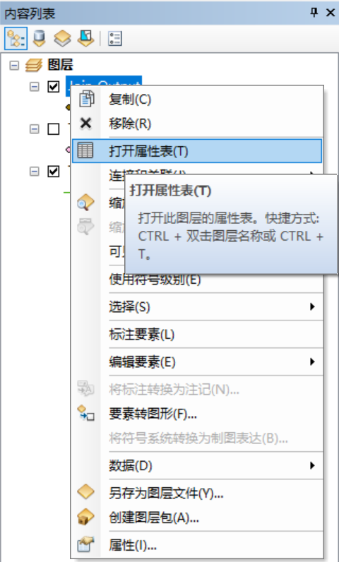

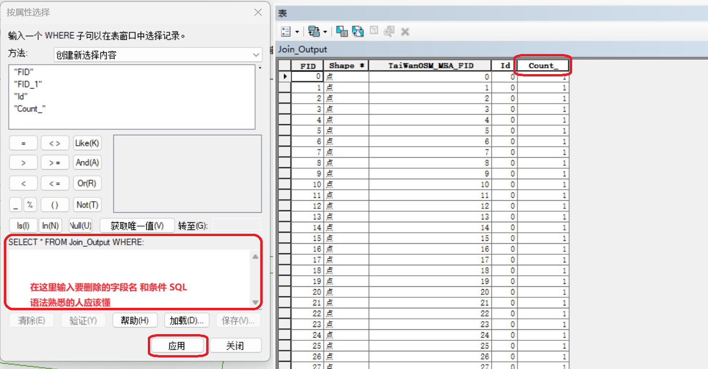

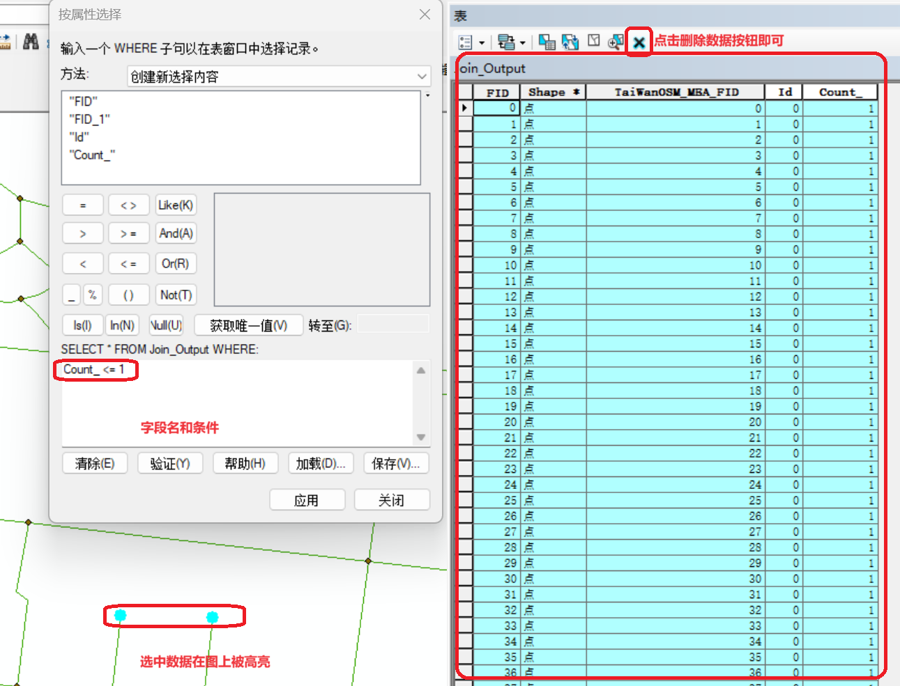

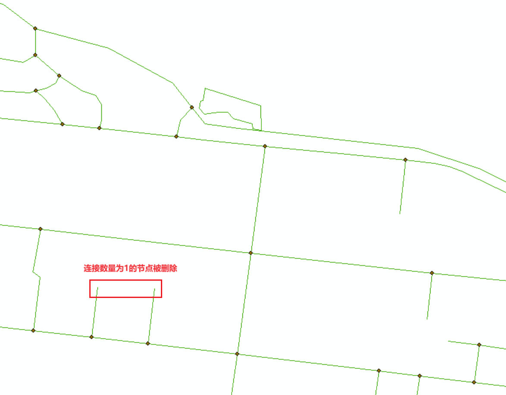
