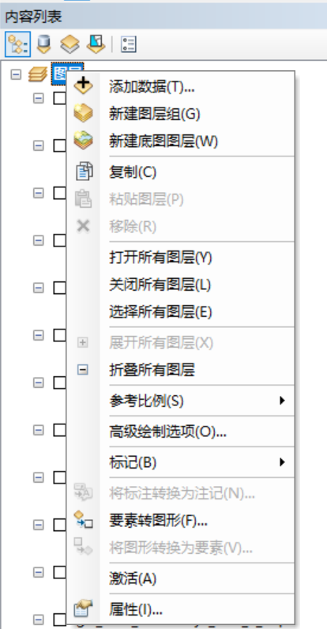
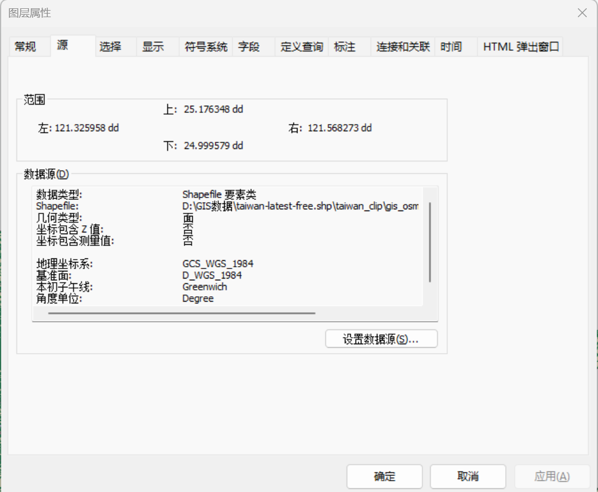
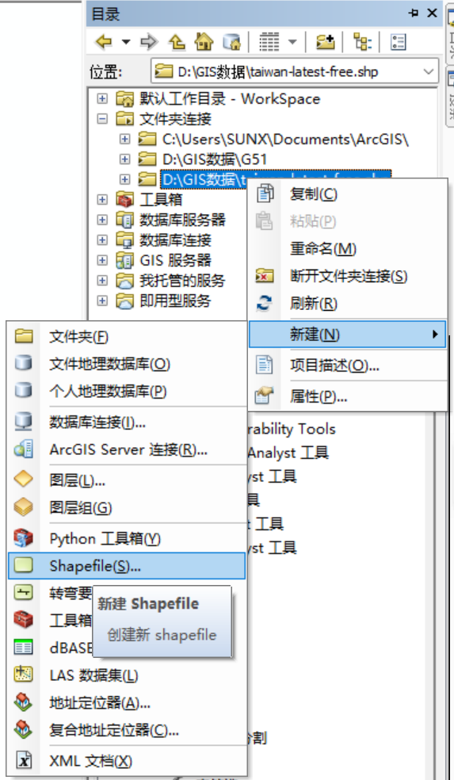
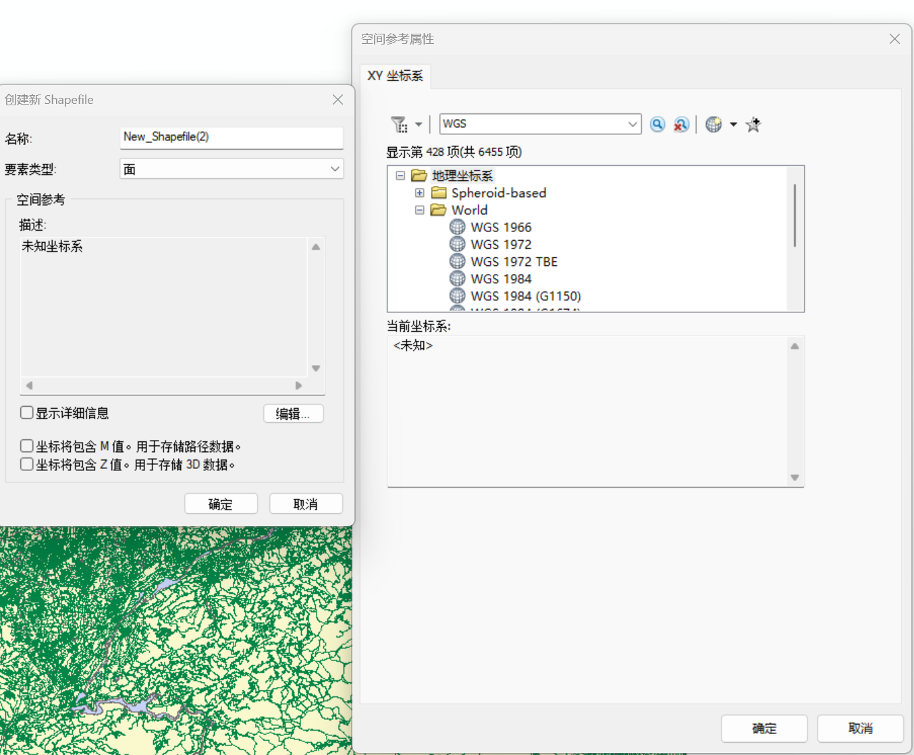
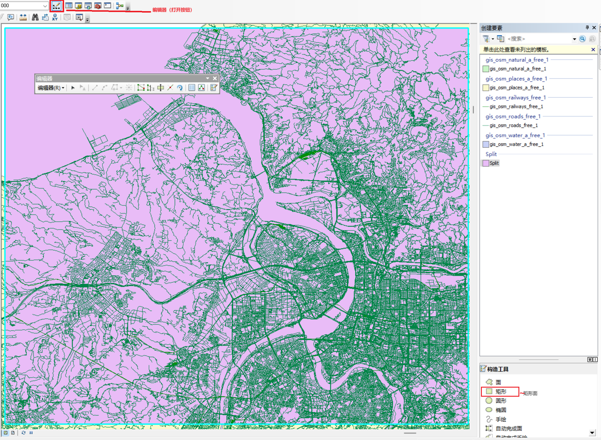
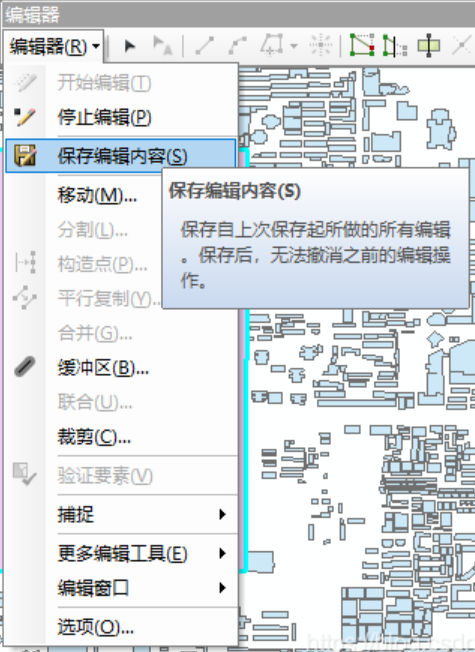
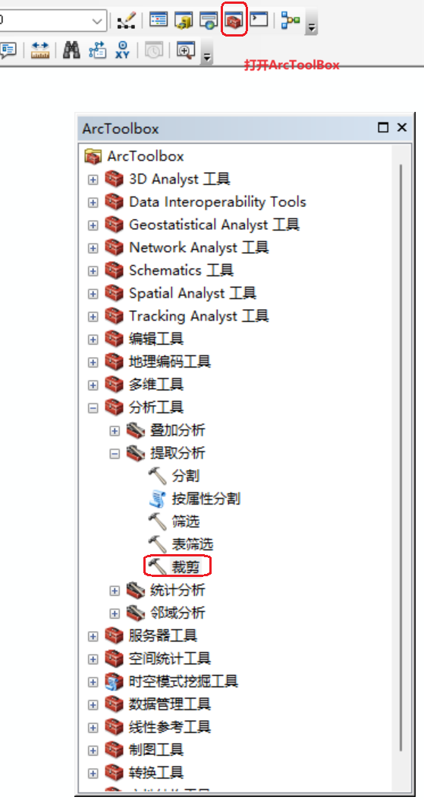
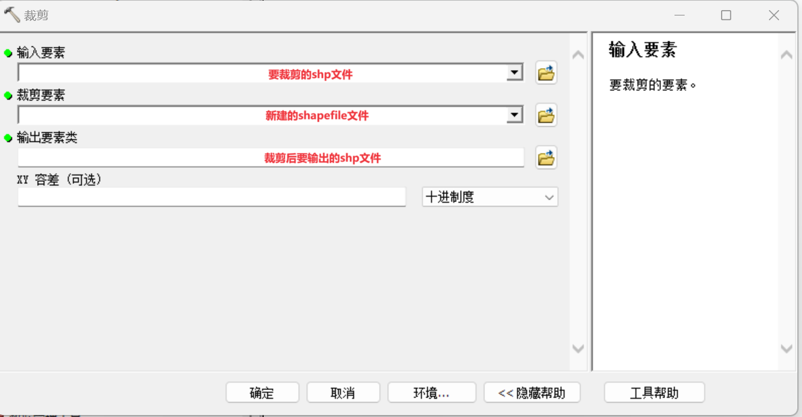

# 新手学习：ArcGIS对SHP文件裁剪

**新手学习**
记录每个步骤，因为有很多控件可能刚开始还不熟悉，根本不知道在哪里，所以写的比较详细。

### 1.添加要裁剪的shp文件

### 2.查看shp文件的地理坐标系

双击shp文件，就可以查看shp文件的地理坐标系

### 3. 新建shapefile面要素

首先需要连接到自己的数据空间。目录在软件的右侧边栏。

右击想要裁剪的文件夹，在该文件夹中新建一个shapefile文件。

选择新建shapefile文件的地理坐标系

### 4. 编辑shapefile文件

编辑新建的shapefile面要素

确定好要裁剪区域后，进行保存

### 5. 进行裁剪

打开ArcToolBox。

进行裁剪
