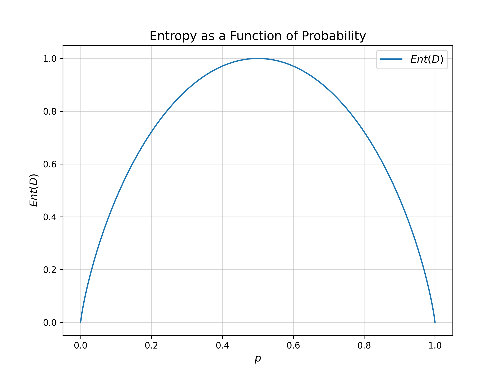

*如何理解分词粒度？*
分词粒度是一种要从哪种角度进行分词的；可以包括字符级（character level）、单词级（word level）、子词级（sub-word level），*（字节级（byte level））；（很难说字节级应该被认为是一种技巧还是一种分词粒度）*
例如对于一句话：`This is the Hugging Face Course.,`
**字符级分词**会按照单个字符进行分词，对于上面这段文本，可以分割为：
```python
['T', 'h', 'i', 's', 't', 'e', 'H', 'u', 'g', 'n', 'F', 'a', 'c', 'C', 'o', 'u', 'r', '.']
```
如果不区分大小写的话（`bert-base-uncased`是一个不区分大小写的分词器）：会先将原文本全部变为小写：`This is the Hugging Face Course.->this is the hugging face course.`
```python
['t', 'h', 'i', 's', 'e', 'u', 'g', 'n', 'f', 'a', 'c', 'o', 'u', 'r', '.']
```
对于中文而言，以`你好，这是一篇关于分词粒度的博客！`为例，则会被分割为：
```python
['你', '好', '这', '是', '一', '篇', '关', '于', '分', '词', '粒', '度', '的', '博', '客']
```

**单词级分词**则会按照词进行分词，这种方法对于英文而言十分方便简单：
```python
['This', 'is', 'Hugging', 'Face', 'Course', '.']
```
>如果按照句子中的空格进行分词，`['This', 'is', 'Hugging', 'Face', 'Course.']`

中文使用词汇级的分词器似乎并不是很多，似乎也不是很合适。
**子词级**分词按照词的子词进行分词，类似于利用词根词缀来进行分词。
```python
['This', 'is', 'the', 'Hu', '##gging', 'Face', 'Course', '.']
```

中文也有对应的子词级的分词，仍然是上述的文本：
```python
['你好', '，', '这', '是一', '篇', '关于', '分', '词', '粒', '度', '的', '博客', '!']
```
（中文分词来自于`Qwen2.5`）


一个更加具有代表性的例子是：`smart, smarter, smartest`；子词级分词器可能会分成这种（来自于`bert-base-cased`）：
```python
['smart', ',', 'smart', '##er', ',', 'smart', '##est']
```
也就是将`smarter->smart+er`以及`smartest->smart+est`。

一个更具有代表性的中文例子是：`小学生，中学生，大学生，新学生`；子词级分词器可能会分成这种（来自于`Qwen2.5`）：
```python
['小学生', '，', '中', '学生', '，', '大学生', '，', '新', '学生']
```

中文分词实际上要比英文分词更难，对于词汇`小学生`可以分为`小学`+`生`，这样非常具有理由；但也可以分解为`小`+`学生`的方式。
```python
['小', '学生',' ，中', '学生', '，','大学', '生', '，新', '学生']
```

#### 总结

字符级分词方法直接用字母和特殊符号来构建词汇表。尽管能够解决未登录词问题（OOV），同时避免了大量词汇（潜在的词义重复问题），但是这种粒度较高，训练成本高，使用时的成本也随着增加（一段英文文本拆分为字母的会产生较大体量的数据）。其次，单个字符缺失了词汇所具有的丰富的语义。

词汇级分词方法直接使用训练集中的所有词汇和特殊符号来构建词汇表。每个词汇表能够保存丰富的语义。但是存在未登录词问题（OOV），同时会产生大量的可能重复的词汇（`word`和`words`只有单复数的区别，但是都会被记录），进而产生压缩率较差的问题。

子词级是对字符级和词汇级的结合，，通过有意识地构造一些词根词缀实现有效地压缩词汇表大小（如比较级`##er`，`##est`，常见单复数`##s`），并且可以通过保留字符元素来减少未登陆此问题。

##### 信息熵角度
$$
H(X) = - \sum ^{N} _{i=1}p(x_i) \log p(x_{i})
$$

信息熵着重表明，信息的**不确定性越高**，信息**熵越大**。
信息的不确定性最大的时候是完全随机状态（可以理解为50%真，50%假）；此时，信息熵大。

一个二元信息熵如图所示；字符级分词出现在`0`端，表明一个字符基本无法表示某种可能的含义，所以信息熵低；词汇级分词出现在`1`端，表明一个词汇的基本含义已经明确，所以信息熵也很低。
子词级分词通过统计思想构造了一些`['##s', '##tion', '###er', '##est']`等可以理解的词根词缀和一些具有统计相关性但不是语言意义上的子词`['hu']`，这些分词要么有语言学的意义要么有统计学上的相关性，同时，他们自身不构成某些明确的含义，只有一定的模糊意义，因此处于一个信息熵较高的状态。
分词需要通过一些方法实现将文本转化为一个具有高信息熵的词汇表；子词级方法更为合适。


>拿房子举个例子叭，尽管不一定贴切；有一个房子，我们可以将房子拆分为厨房、卧室、客厅、卫生间...，这是一种粒度；可以继续拆分为砖、水泥，玻璃...，这又是一种更细的粒度；砖、水泥、玻璃都可以被继续分解为沙子、泥等；这还是一种粒度，因此，房子到底是由什么组成的，取决于从哪种粒度上进行分析。

>*什么是字符？* 字符可以理解文本数据中最小的组成部分。
>字符可以是：
>字母：`A`、`B`、
>数字：`0`、`1`、`Ⅷ`、
>标点符号：`!`、`。`、`?`
>特殊符号：`@`、`#`
>空格、换行等控制字符；
>汉字：`一`、`你`、`好`
>等等

>[tokenizer](https://tiktokenizer.vercel.app/?model=Qwen%2FQwen2.5-72B)