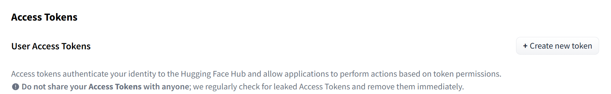

我在尝试下载`mata-llama/Llama-3.3`的模型是，报错。
```python
# 导入模型
tokenizer = AutoTokenizer.from_pretrained("meta-llama/Llama-3.3-70B-Instruct")
```

报错信息如下：
```python
OSError: You are trying to access a gated repo.
Make sure to have access to it at [https://huggingface.co/meta-llama/Llama-3.3-70B-Instruct.](https://huggingface.co/meta-llama/Llama-3.3-70B-Instruct.)
403 Client Error. (Request ID: Root=1-67ea54eb-49ef33f05e22a9c8011b48cb;cf7247cf-4b20-4637-9c02-ef892a964bbe)

Cannot access gated repo for url [https://huggingface.co/meta-llama/Llama-3.3-70B-Instruct/resolve/main/config.json.](https://huggingface.co/meta-llama/Llama-3.3-70B-Instruct/resolve/main/config.json.)
Your request to access model meta-llama/Llama-3.3-70B-Instruct is awaiting a review from the repo authors.
```

原因是我还没有得到授权下载该模型。`hugging face`上存在一些模型，是不能直接下载的，需要得到授权才可以使用的模型。
*那么如何解决这个问题？*
首先在`hugging face`网站上注册一个账号，然后登录自己的账号，点击自己的头像会弹出一个列表，点击`Access Token`，点击`Create new token`；创建一个`Read`权限的`token`即可。

记录下自己创建的`token`。
然后打开终端执行命令：
```shell
pip install "huggingface_hub[cli]"
huggingface-cli login
# 输入自己创建的token即可
```
